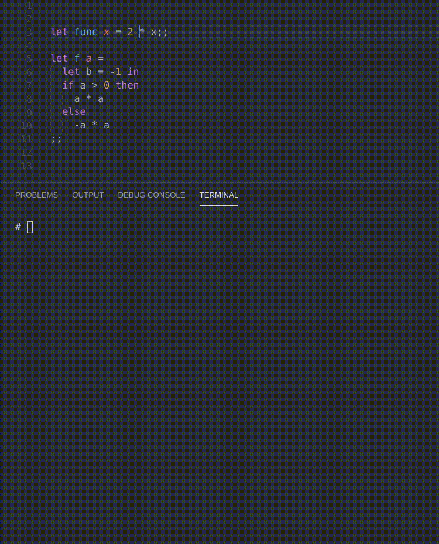

# Caml Select

This extension aims to increase your Caml workflow.
It provides two commands to select or run a Caml function.

Download it [here](https://marketplace.visualstudio.com/items?itemName=Cc618.caml-select "MarketPlace link") or inside VS Code.

## Features

* Select Caml function
* Run Caml function

## Example

